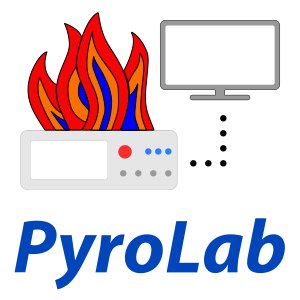

.. PyroLab documentation master file, created by
   sphinx-quickstart on Wed Nov 10 19:21:42 2021.
   You can adapt this file completely to your liking, but it should at least
   contain the root `toctree` directive.

=====================
PyroLab Documentation
=====================

A framework for using remote lab instruments as local resources, built on `Pyro5`_.

.. _Pyro5: https://pyro5.readthedocs.io/en/latest/

Key Features
------------

- Free and open-source software provided under the GPLv3+ License
- Compatible with Python 3.7+.
- Cross-platform: runs on Windows, MacOS, and Linux.
- Included device drivers for several scopes and ThorLabs motion controllers.
- Remotely controlled devices can be accessed through a `Pyro5`_ proxy.

.. panels::
    :card: + intro-card text-center
    :column: col-lg-6 col-md-6 col-sm-6 col-xs-12 d-flex

    ---
    :img-top: _static/images/index_getting_started.svg

    Getting started
    ^^^^^^^^^^^^^^^

    New to *PyroLab*? Check out the getting started guides. They contain an
    introduction to *PyroLab's* main concepts and a step-by-step tutorial for
    beginners.

    +++

    .. link-button:: getting_started
            :type: ref
            :text: To the getting started guides
            :classes: btn-block btn-secondary stretched-link

    ---
    :img-top: _static/images/index_user_guide.svg

    User guide
    ^^^^^^^^^^

    The user guide provides in-depth information on the key concepts of PyroLab
    with useful background information and explanation.

    +++

    .. link-button:: user_guide
            :type: ref
            :text: To the user guide
            :classes: btn-block btn-secondary stretched-link

    ---
    :img-top: _static/images/index_api.svg

    API reference
    ^^^^^^^^^^^^^

    The reference guide contains a detailed description of the PyroLab API. The
    reference describes how the methods work and which parameters can be used.
    It also contains a listing of provided hardware drivers. It assumes that
    you have an understanding of the key concepts.

    +++

    .. link-button:: api_reference
            :type: ref
            :text: To the reference guide
            :classes: btn-block btn-secondary stretched-link

    ---
    :img-top: _static/images/index_contribute.svg

    Developer guide
    ^^^^^^^^^^^^^^^

    Want to add your own device driver? Saw a typo in the documentation? Want to improve
    existing functionalities? The contributing guidelines will guide
    you through the process of improving PyroLab.

    +++

    .. link-button:: development
            :type: ref
            :text: To the development guide
            :classes: btn-block btn-secondary stretched-link

.. toctree::
   :maxdepth: 2
   :hidden:

   getting_started/index
   user_guide/index
   reference/index
   development/index

.. Indices and tables
.. ------------------

.. * :ref:`genindex`
.. * :ref:`modindex`
.. * :ref:`search`
